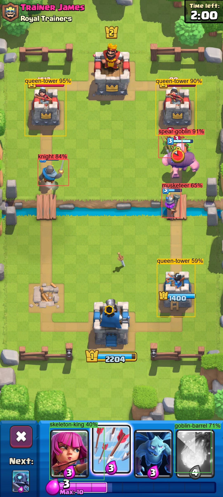

# ClashBot

An autonomous Clash Royale bot built around the **Hog 2.6** deck. It plays inside an Android emulator (LDPlayer 9), using computer vision to read the game and a rule-based engine to decide what to play. Built as a hands-on ML/AI learning project.

## How it works

```
Screen capture (ADB) -> Detection (YOLO + pixel analysis) -> Game state -> Strategy -> Action (ADB tap/swipe)
```

- **Emulator control:** frames are captured and taps/swipes sent over ADB (`pure-python-adb`), with randomized human-like delays.
- **State detection:** pixel-color checks classify the screen (menu, battle, game over, trophy road) and read the elixir bar.
- **Vision:** dual YOLOv8 detectors find troops and buildings; OpenCV template matching identifies the cards in hand.
- **Strategy:** `HogStrategy` follows a defend -> attack -> cycle priority using elixir, hand and detections. A random-play baseline is also included.
- **Menu automation:** the bot queues battles and dismisses result and chest screens on its own.

## Detection demo



Output of the live detection overlay (`data/live_detection.py`) on a real battle frame. Boxes show the class and confidence for towers and troops (e.g. `queen-tower 95%`, `knight 84%`, `musketeer 65%`). Detection is imperfect: the hand-card slots at the bottom are mislabeled (`skeleton-king 40%`, `goblin-barrel 71%`), because the model is built for arena objects, not the card UI. That is why the bot identifies cards with template matching instead.

## Why synthetic data?

Object detection needs thousands of labeled images, and hand-drawing boxes around every troop in every screenshot is impractical. Synthetic data avoids this by generating the labels automatically (`data/generate_training_data.py`):

1. **Take clean backgrounds:** a few screenshots of the empty arena (no troops).
2. **Take sprites:** transparent PNG cut-outs of each unit and building, grouped by class (from the [Clash-Royale-Detection-Dataset](https://github.com/wty-yy/Clash-Royale-Detection-Dataset) sprite library).
3. **Composite randomly:** paste 5-15 sprites per image at random positions inside the arena, with random scale (0.4x-1.2x) and random classes.
4. **Get labels for free:** since the script chooses where each sprite goes, it already knows the exact bounding box and class. It writes them in YOLO format (`class cx cy w h`, normalized), so no manual annotation is needed.
5. **Split and train:** about 85% of images go to training and 15% to validation, then `data/train_yolo.py` fine-tunes YOLOv8 and reports mAP@0.5 (target >= 0.70).

Randomizing position, scale and class forces the model to learn what each unit *looks like* rather than memorizing where units usually appear. The main risk is the "domain gap": pasted sprites lack real-game effects like shadows, health bars, overlaps and animation frames, so a model trained only on synthetic data can score worse on real screenshots than on its own validation set.

## Project layout

```
main.py        Entry point / bot loop
config.py      Coordinates, thresholds, deck definition
bot/           Screen capture, actions, state, vision, strategy, models
data/          Live detection overlay, template capture, YOLO training tools
tests/         pytest suites
```

## Setup

Requires Python 3.11+ and LDPlayer 9 configured to **1080x2400, DPI 320** with ADB enabled. All coordinates in `config.py` assume this resolution.

```bash
python -m venv venv
venv\Scripts\activate
pip install -r requirements.txt
```

## Run

```bash
python main.py          # start the bot
python -m pytest tests  # run tests
```
## Disclaimer

For educational purposes only. Automating the game may violate its terms of service; use at your own risk.
